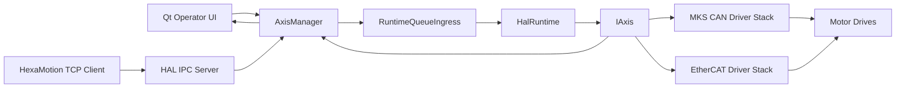
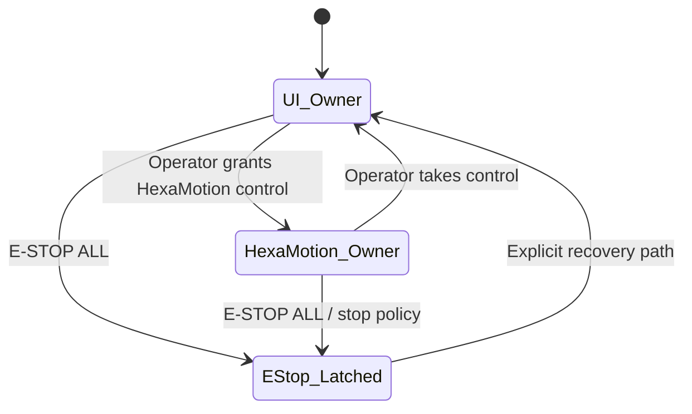
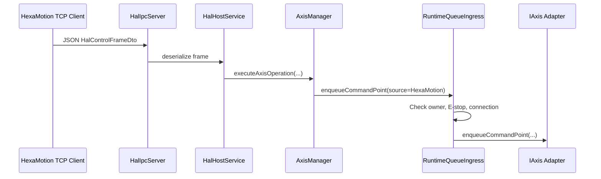
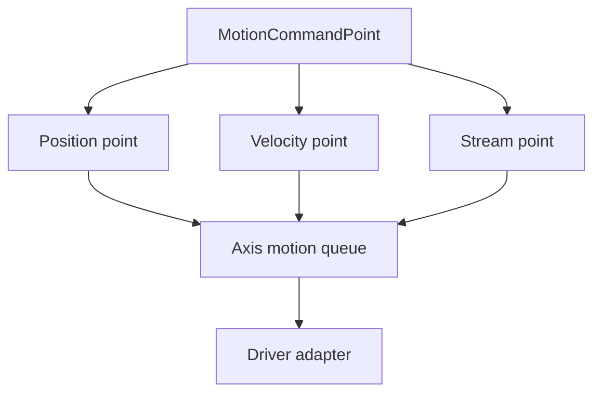

# MotorConfigurator / HexaLabs HAL Architecture

## 1. Purpose and Scope

This document describes the current system architecture of the MotorConfigurator HAL stack.

It replaces the old changelog-style architecture document with a stable engineering reference focused on:

- module responsibilities;
- runtime layering;
- control ownership;
- UI operator priority;
- HexaMotion TCP IPC behavior;
- motion and telemetry contracts;
- safety behavior;
- current implementation limits.

This document describes the **current implementation intent and behavior**. Where the current code does not yet fully meet the target architecture, that is stated explicitly in the limitations section.

---

## 2. System Overview

The application is a host-side HAL and operator UI for industrial axis control across two transport domains:

1. **MKS CAN**
2. **EtherCAT**

An additional domain, **HexaMotion**, acts as an external motion-control client over TCP IPC.

The system has three main responsibilities:

1. provide a local operator UI for configuration, telemetry, and safety actions;
2. provide a runtime abstraction over multiple motion transports;
3. provide a minimal network control surface for HexaMotion through a canonical queue-based HAL API.

The design principle is intentionally narrow:

- one canonical service-command path;
- one canonical motion-command path;
- one canonical telemetry snapshot;
- explicit E-stop path;
- explicit motion ownership policy.

---

## 3. Top-Level Domains

### 3.1 Qt Operator UI

The Qt UI is the operator-facing domain.

It is responsible for:

- live telemetry display;
- transport open/scan/start workflows;
- manual motion requests;
- homing requests;
- parameter-tree interaction;
- operator ownership display;
- global `E-STOP ALL`.

The UI is **not** a direct motor-control backend. It uses the same canonical HAL control surface as other clients.

### 3.2 HexaMotion

HexaMotion is an external TCP client connected through the HAL IPC server.

It is responsible for:

- sending motion setpoints or batches;
- requesting selected service operations;
- observing host state and, once completed in code, canonical telemetry over IPC.

HexaMotion does **not** directly access drivers or transports.

### 3.3 HAL Runtime

The HAL runtime owns:

- transport runtime construction from configuration;
- axis discovery;
- bus manager lifecycle;
- axis lookup;
- shared runtime start/stop lifecycle;
- config import/export and parameter patch application.

### 3.4 Driver Domain

The driver domain contains transport-specific behavior.

- `MksAxisAdapter`, `MksAxisWorker`, `MksCanBusManager`
- `EthercatAxisAdapter`, EtherCAT bus/runtime components

Transport-specific motion semantics, homing behavior, telemetry conversion, and protocol-level details stay in this layer.

---

## 4. Runtime Layering

The intended layering is:

```text
Qt UI / TCP IPC Client
        ↓
AxisManager
        ↓
RuntimeQueueIngress
        ↓
HalRuntime
        ↓
IAxis / IBusManager
        ↓
MKS CAN / EtherCAT drivers
        ↓
Motor drives
```

### 4.1 Layer responsibilities

#### UI / TCP client

- create requests;
- display telemetry and host state;
- never bypass HAL contracts.

#### AxisManager

- central orchestration point for UI and IPC;
- control-source state;
- host-state publishing;
- runtime rebuild/start/stop;
- scan/open transport workflows;
- fast telemetry dispatch to UI;
- mapping of external control operations into canonical runtime commands.

#### RuntimeQueueIngress

- ownership gating for motion commands;
- E-stop gating for motion commands;
- canonical queue ingress into the runtime.

#### HalRuntime

- runtime open/close/start/stop;
- axis and bus manager registry;
- config-driven runtime construction;
- parameter import/export/apply.

#### IAxis / IBusManager

- minimal runtime contracts;
- transport-independent abstraction surface.

#### Drivers

- transport-specific motion execution;
- telemetry decode;
- transport-specific homing logic;
- queue consumption and protocol generation.

---

## 5. System Context Diagram

Plain-text fallback:

```text
Qt Operator UI ---------> AxisManager ---------> RuntimeQueueIngress ---------> HalRuntime ---------> IAxis
       ^                         ^                                                                   |
       |                         |                                                                   |
       |                         +----------- HAL IPC Server <----------- HexaMotion TCP Client     |
       |                                                                                             |
       +----------------------------- telemetry / host state <---------------------------------------+

IAxis ---------> MKS CAN Driver Stack ---------> Motor Drives
IAxis ---------> EtherCAT Driver Stack --------> Motor Drives
```



---

## 6. Minimal Public Control Contract

The system intentionally exposes a minimal orchestration surface.

### 6.1 Service commands

All service-type actions are represented by `ServiceCommandPoint`.

Typical operations include:

- enable;
- disable;
- home;
- clear errors;
- set zero;
- reset drive;
- clear motion queue;
- set operating mode.

### 6.2 Motion commands

All motion actions are represented by `MotionCommandPoint`.

Supported motion classes:

- `Position`
- `Velocity`
- `Stream`

### 6.3 Telemetry

All runtime feedback is represented by `TelemetrySnapshot`.

Key invariant:

- `position` = actual position;
- `velocity` = actual velocity;
- `current` = actual current/torque proxy;
- `target_position` = requested target when available;
- `has_target_position` indicates whether a target source is explicitly known.

### 6.4 E-stop

E-stop is a separate high-priority action and is intentionally not treated as ordinary motion.

---

## 7. Control Ownership and Operator Priority

### 7.1 Ownership model

The system currently supports two motion sources:

- `UI`
- `HexaMotion`

Only one source may own motion submission at a time.

`RuntimeQueueIngress` enforces motion ownership by checking the current `MotionControlSource`.

### 7.2 Required operator-priority rule

The current target policy is:

> HexaMotion may own trajectory generation only while the UI allows it.  
> The UI always owns safety, visibility, and takeover.

This means:

1. UI telemetry must remain visible even during HexaMotion control.
2. UI must always be able to trigger stop / E-stop.
3. UI must always be able to see current ownership.
4. UI must always be able to take ownership back.
5. Simultaneous motion control from UI and HexaMotion is not allowed.

### 7.3 Ownership state diagram

Plain-text fallback:

```text
[UI Owner] <-----------------------------> [HexaMotion Owner]
    |                                            |
    | E-STOP ALL                                | E-STOP ALL / stop policy
    v                                            v
                 [E-STOP Latched]
                        |
                        | explicit recovery
                        v
                    [UI Owner]
```



---

## 8. TCP / HexaMotion IPC Contract

### 8.1 Transport

The IPC layer is a TCP server implemented by `HalIpcServer` and wrapped by `HalHostService`.

Current default configuration:

- bind host: `127.0.0.1`
- port: `30110`

This means the default configuration is loopback-only unless the bind host is changed.

### 8.2 Protocol

The protocol uses line-delimited JSON messages.

Main DTOs:

- `HalControlFrameDto`
- `HalStateFrameDto`

HexaMotion is identified by:

- `client_id = 1`

The local UI in the same protocol space is identified by:

- `client_id = 2`

### 8.3 IPC control flow

Plain-text fallback:

```text
HexaMotion TCP Client
    -> HalIpcServer
    -> HalHostService
    -> AxisManager::executeAxisOperation(...)
    -> RuntimeQueueIngress
    -> IAxis Adapter
    -> Transport-specific driver / motor
```



### 8.4 Supported control concepts

The current code supports, at minimum:

- `StreamPoint`
- `EnqueueMotionBatch`
- `EnableAxis`
- `DisableAxis`
- `SetZero`
- `ClearFault`
- `Home`
- `Stop`
- `Hold`
- `ClearMotionQueue`
- `SetAxisMode`

### 8.5 Homing over TCP

Single-axis homing is supported conceptually through `ControlOp::Home`.

MKS sequence homing has runtime support in `AxisManager`, but protocol string serialization/deserialization still requires completion for all related enum values.

---

## 9. Motion Command Model

### 9.1 Core motion principle

Motion in the current HAL is **queue-of-setpoints based**.

It is not a high-level multi-axis trajectory planner inside HAL.

The HAL transports and schedules discrete `MotionCommandPoint` samples.

### 9.2 Practical interpretation

- a **single point** behaves like a waypoint/profile move;
- a **sequence of points** behaves like sampled trajectory streaming;
- continuity depends on the sender continuously feeding points.

### 9.3 Motion model diagram

Plain-text fallback:

```text
MotionCommandPoint
    +-- Position point --+
    +-- Velocity point --+--> Axis motion queue --> Driver adapter
    +-- Stream point ----+
```



### 9.4 Consequence

If HexaMotion is the trajectory source, then HexaMotion is responsible for time-consistent point generation, queue refill, and axis synchronization strategy.

HAL does not currently provide spline generation, blending, jerk-limited online planning, or global robotic interpolation.

---

## 10. Telemetry Model

Each axis exposes a canonical `TelemetrySnapshot`.

The UI fast-tick loop in `AxisManager::onFastTick()` reads this snapshot and publishes UI-facing telemetry maps.

The UI can display during motion:

- actual position;
- actual velocity;
- target position when available;
- state;
- mode;
- status word;
- fault/protection indicators;
- selected transport-specific status, such as MKS homing sequence text.

The system must preserve the invariant that actual position never gets overwritten by requested target.

---

## 11. Safety Model

Current safety intent:

1. E-stop is above ownership.
2. Operator visibility is above ownership.
3. Operator takeover is above remote motion control.
4. Motion commands must be rejected when ownership or E-stop state forbids them.

After runtime start, the current implementation applies a baseline per started axis:

- `Disable`
- `SetZero`

The UI provides a global `E-STOP ALL` action and it must remain available regardless of remote ownership.

The current software architecture improves orchestration safety, but it is not by itself a certified machine-safety system.

---

## 12. MKS CAN Runtime

For MKS:

- transport domain identity is `mks_can`;
- logical axis identity is aligned with CAN ID;
- runtime activation is gated by the latest successful scan snapshot.

`MksAxisAdapter` normalizes relative motion locally.

For position-like commands:

1. if the point is relative, it is converted to an absolute target;
2. the base is the last requested target if available, otherwise latest actual telemetry position;
3. driver-side software limits are checked in motor-angle space;
4. the point is queued to the MKS worker/motion mode.

MKS homing is implemented as a driver-specific procedural state machine:

1. hardware home request;
2. wait until home becomes active;
3. wait until home finishes and settles near zero;
4. move to configured homing offset;
5. final set-zero.

---

## 13. EtherCAT Runtime

EtherCAT is treated as its own transport domain with a normalized identity.

Current project policy keeps EtherCAT Linux-oriented and separate from the Windows-targeted MKS path.

EtherCAT uses the same canonical `MotionCommandPoint` model but executes it through EtherCAT-specific runtime behavior.

Depending on the active mode, points are interpreted as:

- profile-position targets;
- cyclic-sync-position updates;
- profile/cyclic velocity requests.

EtherCAT telemetry explicitly publishes actual position, actual velocity, torque/current proxy, and commanded target position.

---

## 14. Configuration Model

The HAL configuration describes:

- topology intent;
- runtime intent;
- per-axis config references.

It is not the source of truth for current live transport-open state.

Runtime is built from:

- configured topology;
- currently opened live transport endpoint;
- latest valid scan state where required.

Axis config files store parameter snapshots and are applied back through the canonical axis config path.

---

## 15. Threading and Timing Model

The runtime loop is implemented as a periodic worker thread.

Current platform policy:

- Linux: best-effort `mlockall` + `SCHED_FIFO`
- Windows: best-effort thread priority increase only

Windows is **not** treated as a hard real-time platform.

The UI uses a 4 ms fast timer for telemetry update dispatch. This timer is for observation and UI orchestration, not for hard real-time motor control.

---

## 16. Command Classification Table

| Command class | Source | Owner-gated | UI always allowed | Notes |
|---|---:|---:|---:|---|
| Motion stream / move | UI / HexaMotion | Yes | No | Prevents simultaneous motion owners |
| Enable / Disable | UI / TCP | Partially | Should remain operator-available | Service policy must stay explicit |
| Home | UI / TCP | Partially | Operator should be able to control via takeover | MKS homing is driver-specific |
| E-STOP ALL | UI | No | Yes | Must remain always available |
| TCP Stop | TCP | No / partial | N/A | Should be made semantically explicit versus latched E-stop |
| Telemetry view | UI / TCP | No | Yes | UI must always show operator information |

---

## 17. Current Limitations and Required Engineering Fixes

The following items should be treated as explicit current gaps rather than hidden assumptions.

### 17.1 IPC telemetry population

`HalStateFrameDto` defines axis telemetry fields, but the host-state provider path must explicitly populate these from canonical axis telemetry for reliable HexaMotion feedback.

### 17.2 MKS homing-sequence protocol exposure

MKS sequence homing is represented in runtime code, but protocol string serialization/deserialization must fully include all related operations for robust JSON IPC use.

### 17.3 Stop versus latched E-stop semantics

The distinction between immediate stop, per-axis estop call, and global latched E-stop state must be explicit and consistent across UI and TCP paths.

### 17.4 Always-on operator telemetry

High-rate UI telemetry currently follows watched/workspace axes. Operator visibility for all active axes should remain explicit and reliable even during HexaMotion ownership.

### 17.5 Windows timing expectations

Windows remains a best-effort runtime environment and must not be treated as equivalent to hard real-time Linux behavior.

---

## 18. Development Rules and Invariants

The following invariants must be preserved in further development.

1. **No direct driver bypass from UI or HexaMotion.**
2. **One canonical motion ingress path.**
3. **One canonical service ingress path.**
4. **One canonical telemetry snapshot per axis.**
5. **Actual and target semantics must remain separate.**
6. **Transport-specific behavior must remain inside transport-specific drivers.**
7. **UI safety actions must not depend on remote ownership.**
8. **Operator visibility must remain available during HexaMotion control.**
9. **Configuration intent and live transport state must remain semantically separate.**

---

## 19. Summary

The current architecture is a pragmatic HAL built around a minimal queue-based control surface.

Its core design is:

- a local operator UI;
- a canonical runtime abstraction over MKS CAN and EtherCAT;
- a TCP IPC bridge for HexaMotion;
- explicit control ownership;
- explicit safety actions;
- canonical telemetry snapshots.

The key intended policy is:

> HexaMotion may generate motion only while the UI allows it.  
> The UI always keeps operator priority for telemetry, stop, and takeover.

This must remain the governing architectural rule for future implementation work.